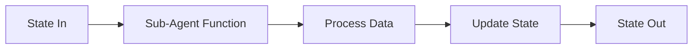

# Extensibility Guide

This guide explains how to extend the Twilio Energy Monitor system by adding new sub-agents to the LangGraph workflow.

## Overview

The system is built with modularity in mind using LangGraph's state graph architecture. Each sub-agent is a node in the graph that:
- Receives the current workflow state
- Performs a specific task
- Updates and returns the modified state

## Architecture Pattern



## Adding a New Sub-Agent

Follow these steps to add a new sub-agent to the workflow:

### Step 1: Extend the AgentState

Add new fields to the `AgentState` TypedDict in `src/twilio_energy_monitor/models.py`:

```python
from typing import TypedDict, Optional, List

class AgentState(TypedDict):
    # Existing fields
    message_sid: str
    from_number: str
    message_body: str
    media_urls: List[str]
    has_image: bool
    is_energy_counter: bool
    extracted_date: Optional[str]
    extracted_measurement: Optional[float]
    bigquery_success: bool
    response_message: str
    
    # Add your new fields here
    anomaly_detected: bool  # Example: anomaly detection flag
    anomaly_details: Optional[str]  # Example: anomaly description
```

**Guidelines:**
- Use descriptive field names
- Use `Optional[]` for fields that may not always be populated
- Add type hints for all fields
- Document the purpose of new fields in comments

### Step 2: Create the Sub-Agent Function

Create a new file in `src/twilio_energy_monitor/nodes/agents/` for your sub-agent:

```python
# src/twilio_energy_monitor/nodes/agents/anomaly_detector.py

from typing import Dict, Any
import logging
from ...models import AgentState
from ...config import settings

logger = logging.getLogger(__name__)

def detect_anomaly(state: AgentState) -> Dict[str, Any]:
    """
    Detects anomalies in energy readings by comparing with historical data.
    
    Args:
        state: Current workflow state containing extracted measurement
        
    Returns:
        Updated state with anomaly detection results
    """
    logger.info(f"Detecting anomalies for measurement: {state.get('extracted_measurement')}")
    
    try:
        measurement = state.get("extracted_measurement")
        
        if measurement is None:
            logger.warning("No measurement available for anomaly detection")
            return {
                "anomaly_detected": False,
                "anomaly_details": None
            }
        
        # Your anomaly detection logic here
        # Example: Check if measurement is significantly higher than average
        threshold = 2000.0  # Example threshold
        
        if measurement > threshold:
            logger.warning(f"Anomaly detected: {measurement} exceeds threshold {threshold}")
            return {
                "anomaly_detected": True,
                "anomaly_details": f"Reading {measurement} kWh is unusually high"
            }
        
        logger.info("No anomaly detected")
        return {
            "anomaly_detected": False,
            "anomaly_details": None
        }
        
    except Exception as e:
        logger.error(f"Error in anomaly detection: {e}", exc_info=True)
        return {
            "anomaly_detected": False,
            "anomaly_details": None
        }
```

**Best Practices:**
- Always accept `AgentState` as the parameter
- Return a dictionary with only the fields you're updating
- Include comprehensive error handling
- Add logging for debugging
- Keep functions focused on a single responsibility
- Use type hints

### Step 3: Register the Node in the Workflow

Update `src/twilio_energy_monitor/nodes/agents/workflow.py` to include your new sub-agent:

```python
from langgraph.graph import StateGraph, END
from ...models import AgentState
from ..parser import parse_message
from .classifier import classify_image
from .extractor import extract_reading
from ..bigquery_writer import write_to_bigquery
from .responder import generate_response
from .anomaly_detector import detect_anomaly  # Import your new sub-agent

def create_workflow():
    """Creates and compiles the LangGraph workflow."""
    
    # Initialize the state graph
    workflow = StateGraph(AgentState)
    
    # Add all nodes
    workflow.add_node("parse_message", parse_message)
    workflow.add_node("classify_image", classify_image)
    workflow.add_node("extract_reading", extract_reading)
    workflow.add_node("detect_anomaly", detect_anomaly)  # Add your node
    workflow.add_node("write_to_bigquery", write_to_bigquery)
    workflow.add_node("generate_response", generate_response)
    
    # Set entry point
    workflow.set_entry_point("parse_message")
    
    # Add edges (existing)
    workflow.add_conditional_edges(
        "parse_message",
        lambda state: "classify_image" if state.get("has_image") else END
    )
    
    workflow.add_conditional_edges(
        "classify_image",
        lambda state: "extract_reading" if state.get("is_energy_counter") else END
    )
    
    # Add your node to the workflow
    workflow.add_edge("extract_reading", "detect_anomaly")
    workflow.add_edge("detect_anomaly", "write_to_bigquery")
    
    # Continue with existing edges
    workflow.add_edge("write_to_bigquery", "generate_response")
    workflow.add_edge("generate_response", END)
    
    return workflow.compile()
```

### Step 4: Add Conditional Routing (Optional)

If your sub-agent should only run under certain conditions, use conditional edges:

```python
def should_detect_anomaly(state: AgentState) -> str:
    """Determines if anomaly detection should run."""
    # Only detect anomalies if we have a valid measurement
    if state.get("extracted_measurement") is not None:
        return "detect_anomaly"
    return "write_to_bigquery"

# In create_workflow():
workflow.add_conditional_edges(
    "extract_reading",
    should_detect_anomaly,
    {
        "detect_anomaly": "detect_anomaly",
        "write_to_bigquery": "write_to_bigquery"
    }
)
```

### Step 5: Update Response Generator (Optional)

If your sub-agent should affect the user response, update `src/twilio_energy_monitor/nodes/agents/responder.py`:

```python
def generate_response(state: AgentState) -> Dict[str, Any]:
    """Generates response message based on workflow results."""
    
    if not state.get("bigquery_success"):
        message = "❌ Failed to register reading. Please try again."
    else:
        date = state.get("extracted_date", "unknown date")
        measurement = state.get("extracted_measurement", "unknown")
        message = f"✅ Energy reading registered: {measurement} kWh on {date}"
        
        # Add anomaly warning if detected
        if state.get("anomaly_detected"):
            anomaly_details = state.get("anomaly_details", "")
            message += f"\n⚠️ Warning: {anomaly_details}"
    
    # Send response via Twilio
    # ... rest of the function
```

### Step 6: Add Tests

Create tests for your new sub-agent in `tests/test_agents.py`:

```python
def test_detect_anomaly_high_reading():
    """Test anomaly detection with high reading."""
    state = {
        "extracted_measurement": 3000.0,
        "extracted_date": "2025-11-15"
    }
    
    result = detect_anomaly(state)
    
    assert result["anomaly_detected"] is True
    assert "unusually high" in result["anomaly_details"]

def test_detect_anomaly_normal_reading():
    """Test anomaly detection with normal reading."""
    state = {
        "extracted_measurement": 1500.0,
        "extracted_date": "2025-11-15"
    }
    
    result = detect_anomaly(state)
    
    assert result["anomaly_detected"] is False
    assert result["anomaly_details"] is None

def test_detect_anomaly_no_measurement():
    """Test anomaly detection with missing measurement."""
    state = {
        "extracted_measurement": None
    }
    
    result = detect_anomaly(state)
    
    assert result["anomaly_detected"] is False
```

## Example Use Cases

### 1. Bill Calculator Sub-Agent

Calculates estimated bill based on reading and rate:

```python
# models.py
class AgentState(TypedDict):
    # ... existing fields
    estimated_bill: Optional[float]
    rate_per_kwh: float

# agents/bill_calculator.py
def calculate_bill(state: AgentState) -> Dict[str, Any]:
    measurement = state.get("extracted_measurement", 0)
    rate = state.get("rate_per_kwh", 0.12)  # Default rate
    
    return {
        "estimated_bill": measurement * rate
    }
```

### 2. Historical Comparison Sub-Agent

Compares current reading with previous readings:

```python
# models.py
class AgentState(TypedDict):
    # ... existing fields
    previous_reading: Optional[float]
    consumption_change: Optional[float]
    consumption_trend: Optional[str]

# agents/historical_comparator.py
def compare_with_history(state: AgentState) -> Dict[str, Any]:
    from google.cloud import bigquery
    
    current = state.get("extracted_measurement")
    date = state.get("extracted_date")
    
    # Query BigQuery for previous reading
    # Calculate change and trend
    # Return updated state
```

### 3. Multi-Language Response Sub-Agent

Detects user language and translates responses:

```python
# models.py
class AgentState(TypedDict):
    # ... existing fields
    detected_language: Optional[str]
    translated_response: Optional[str]

# agents/translator.py
def translate_response(state: AgentState) -> Dict[str, Any]:
    from langchain_google_vertexai import ChatVertexAI
    
    message_body = state.get("message_body", "")
    response = state.get("response_message", "")
    
    # Detect language from message_body
    # Translate response if needed
    # Return translated response
```

## State Management Best Practices

1. **Immutability**: Don't modify the input state directly; return new values
2. **Partial Updates**: Only return fields you're updating
3. **Optional Fields**: Use `Optional[]` for fields that may not be set
4. **Default Values**: Use `.get()` with defaults when accessing state
5. **Type Safety**: Always use type hints for better IDE support

## Error Handling Patterns

```python
def my_sub_agent(state: AgentState) -> Dict[str, Any]:
    try:
        # Your logic here
        result = process_data(state)
        
        return {
            "my_field": result,
            "my_error": None
        }
        
    except SpecificException as e:
        logger.error(f"Specific error: {e}")
        return {
            "my_field": None,
            "my_error": str(e)
        }
        
    except Exception as e:
        logger.error(f"Unexpected error: {e}", exc_info=True)
        return {
            "my_field": None,
            "my_error": "An unexpected error occurred"
        }
```

## Testing Your Sub-Agent

1. **Unit Tests**: Test the sub-agent function in isolation
2. **Integration Tests**: Test the sub-agent within the workflow
3. **Mock External Services**: Use mocks for API calls and database operations

```python
from unittest.mock import patch, MagicMock

@patch('src.twilio_energy_monitor.nodes.agents.anomaly_detector.some_external_service')
def test_anomaly_detector_with_mock(mock_service):
    mock_service.return_value = {"is_anomaly": True}
    
    state = {"extracted_measurement": 3000.0}
    result = detect_anomaly(state)
    
    assert result["anomaly_detected"] is True
    mock_service.assert_called_once()
```

## Debugging Tips

1. **Enable Debug Logging**: Set `LOG_LEVEL=DEBUG` in `.env`
2. **Print State**: Add logging to see state at each node
3. **Use Breakpoints**: Debug with your IDE's debugger
4. **Test Individually**: Test sub-agents before integrating into workflow

```python
# Add to your sub-agent for debugging
logger.debug(f"Input state: {state}")
logger.debug(f"Output state: {result}")
```

## Performance Considerations

- **Async Operations**: Consider using async functions for I/O-bound operations
- **Caching**: Cache expensive computations or API calls
- **Parallel Execution**: LangGraph supports parallel node execution
- **Timeouts**: Add timeouts for external API calls

## Further Resources

- [LangGraph Documentation](https://langchain-ai.github.io/langgraph/)
- [LangChain Documentation](https://python.langchain.com/)
- [Vertex AI Documentation](https://cloud.google.com/vertex-ai/docs)
- [BigQuery Documentation](https://cloud.google.com/bigquery/docs)

## Questions?

If you have questions about extending the system, please:
1. Review the existing sub-agents in `src/twilio_energy_monitor/nodes/agents/`
2. Check the LangGraph documentation
3. Open an issue in the repository
