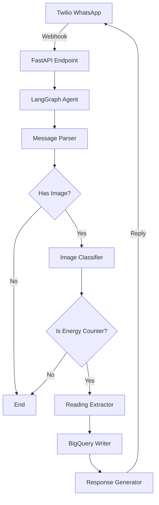

# Twilio Energy Monitor

A FastAPI-based backend service that receives energy meter images via Twilio WhatsApp, processes them using Google Vertex AI (Gemini), and stores readings in BigQuery. Built with LangGraph for modular, extensible agent orchestration.

## Architecture



## Features

- **Automated Image Recognition**: Uses Gemini Vision to identify energy meter displays
- **Data Extraction**: Extracts measurement values and dates from meter images
- **BigQuery Storage**: Persists readings with automatic table creation and duplicate handling
- **WhatsApp Integration**: Sends confirmation messages back to users
- **Modular Architecture**: LangGraph-based workflow enables easy addition of new sub-agents
- **Secure**: Twilio webhook signature verification and Google Cloud authentication

## Prerequisites

- Python 3.11+
- [UV package manager](https://docs.astral.sh/uv/)
- Google Cloud Project with:
  - Vertex AI API enabled
  - BigQuery API enabled
  - Application Default Credentials configured
- Twilio account with WhatsApp sandbox or approved number

## Installation

### 1. Install UV

```bash
# macOS/Linux
curl -LsSf https://astral.sh/uv/install.sh | sh

# Or with pip
pip install uv
```

### 2. Clone and Setup Project

```bash
git clone <repository-url>
cd twilio-energy-monitor

# Install dependencies
uv sync
```

### 3. Configure Environment Variables

Copy the example environment file and fill in your credentials:

```bash
cp .env.example .env
```

Edit `.env` with your configuration:

```env
# Twilio Configuration
TWILIO_ACCOUNT_SID=your_account_sid_here
TWILIO_AUTH_TOKEN=your_auth_token_here
TWILIO_PHONE_NUMBER=whatsapp:+14155238886

# Google Cloud Configuration
GOOGLE_CLOUD_PROJECT=your-project-id
VERTEX_AI_LOCATION=us-central1
BIGQUERY_DATASET=energy_monitoring
BIGQUERY_TABLE=meter_readings

# Application Configuration
ENVIRONMENT=development
LOG_LEVEL=INFO
```

### 4. Authenticate with Google Cloud

```bash
# Set up Application Default Credentials
gcloud auth application-default login

# Set your project
gcloud config set project your-project-id
```

## Usage

### Running the Application

```bash
# Development mode with auto-reload
uv run uvicorn src.twilio_energy_monitor.main:app --reload --host 0.0.0.0 --port 8000

# Production mode
uv run uvicorn src.twilio_energy_monitor.main:app --host 0.0.0.0 --port 8000 --workers 4
```

The API will be available at `http://localhost:8000`

### Running Tests

```bash
# Run all tests
uv run pytest

# Run with coverage
uv run pytest --cov=src/twilio_energy_monitor

# Run specific test file
uv run pytest tests/test_workflow.py
```

## Twilio Webhook Setup

### 1. Expose Your Local Server (Development)

Use ngrok or similar tool to expose your local server:

```bash
ngrok http 8000
```

Note the HTTPS URL provided (e.g., `https://abc123.ngrok.io`)

### 2. Configure Twilio Webhook

1. Go to [Twilio Console](https://console.twilio.com/)
2. Navigate to **Messaging** > **Settings** > **WhatsApp Sandbox Settings**
3. Set the webhook URL for incoming messages:
   ```
   https://your-domain.com/webhook/twilio
   ```
4. Set HTTP method to **POST**
5. Save the configuration

### 3. Test the Integration

Send a WhatsApp message with an energy meter image to your Twilio number. You should receive:
- A confirmation message if the meter is recognized and reading is extracted
- An error message if processing fails

Example success response:
```
✅ Energy reading registered: 1234.5 kWh on 2025-11-15
```

## Project Structure

```
twilio-energy-monitor/
├── .env.example              # Environment variable template
├── pyproject.toml            # UV project configuration
├── README.md                 # This file
├── main.py                   # Application entry point
├── src/
│   └── twilio_energy_monitor/
│       ├── __init__.py
│       ├── config.py         # Settings management
│       ├── models.py         # Data models and state definitions
│       ├── nodes/
│       │   ├── parser.py     # Message parsing logic
│       │   ├── bigquery_writer.py  # BigQuery operations
│       │   └── agents/
│       │       ├── classifier.py   # Image classification
│       │       ├── extractor.py    # Reading extraction
│       │       ├── responder.py    # Response generation
│       │       └── workflow.py     # LangGraph orchestration
│       └── utils/
│           ├── retry.py      # Retry logic utilities
│           └── twilio_utils.py  # Twilio helpers
└── tests/
    ├── conftest.py           # Test fixtures
    ├── test_agents.py        # Sub-agent unit tests
    ├── test_workflow.py      # Workflow integration tests
    └── test_api.py           # API endpoint tests
```

## API Endpoints

### POST /webhook/twilio

Receives incoming Twilio WhatsApp messages.

**Headers:**
- `X-Twilio-Signature`: Twilio signature for verification

**Form Data:**
- `MessageSid`: Unique message identifier
- `From`: Sender's phone number
- `Body`: Message text content
- `NumMedia`: Number of media attachments
- `MediaUrl0`, `MediaUrl1`, etc.: URLs to media files

**Response:**
- `200 OK`: Message received and processing started

### GET /health

Health check endpoint.

**Response:**
```json
{
  "status": "healthy",
  "service": "twilio-energy-monitor"
}
```

## Extending the System

See [EXTENSIBILITY.md](EXTENSIBILITY.md) for detailed guide on adding new sub-agents to the workflow.

Quick example:
1. Create new sub-agent function in `src/twilio_energy_monitor/nodes/agents/`
2. Add fields to `AgentState` in `models.py`
3. Register node in workflow graph in `workflow.py`
4. Add conditional routing if needed

## Troubleshooting

### Twilio Signature Verification Fails

- Ensure `TWILIO_AUTH_TOKEN` is correct
- Check that webhook URL matches exactly (including https://)
- Verify no proxy is modifying the request

### Vertex AI Authentication Errors

```bash
# Re-authenticate
gcloud auth application-default login

# Verify credentials
gcloud auth application-default print-access-token
```

### BigQuery Permission Errors

Ensure your service account or user has these roles:
- `roles/bigquery.dataEditor`
- `roles/bigquery.jobUser`

### Image Download Fails

- Check Twilio media URL expiration (valid for 24 hours)
- Verify network connectivity
- Check firewall rules

## Development

### Adding Dependencies

```bash
# Add a new dependency
uv add package-name

# Add a development dependency
uv add --dev package-name
```

### Code Formatting

```bash
# Format code with black
uv run black src/ tests/

# Sort imports
uv run isort src/ tests/
```

## License

[Your License Here]

## Contributing

[Your Contributing Guidelines Here]
