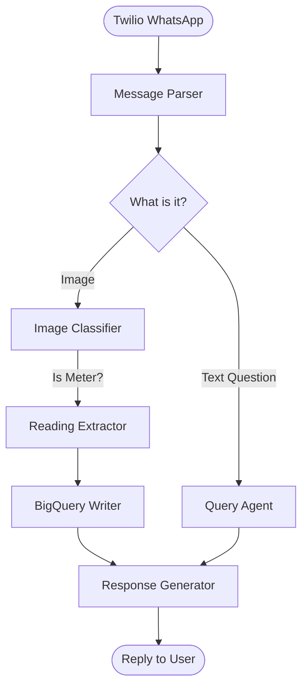
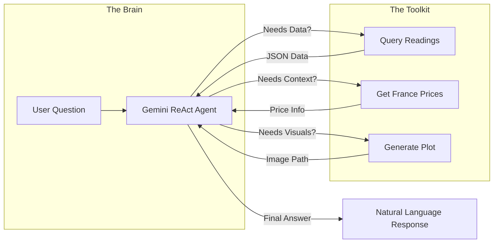

# Energy Budy: The Overpowered Personal Assistant

> *How I used a sledgehammer to crack a nut, and learned to love the graph along the way.*

## The Story

It started with a simple, personal problem: I wanted to track my energy consumption. 

I have an energy meter. I have a phone. I wanted to take a picture of the meter, send it somewhere, and have it magically tracked. Also in my defense, No I don't have a smart meter nor access to the service provider's platform.

The "sensible" engineering solution would be a simple script: receive image -> OCR -> save to DB. Done.

But we live in the age of AI, so naturally, I chose the **overpowered** route. I decided to build a full-blown AI assistant to handle it. 

However, as I built it, I realized something crucial about building with LLMs: **Not everything should be an agent.** 

If you give an LLM *too much* freedom, it might hallucinate, get distracted, or just fail to do the simple things reliably. You don't want an "creative" agent parsing a critical meter reading. You want a robot.

This project, **Energy Budy**, is the result. It's a demonstration of a **Hybrid Architecture** using [LangGraph](https://github.com/langchain-ai/langgraph). It combines:
1.  **Deterministic Logic**: For things that *must* happen the same way every time (parsing messages, routing).
2.  **Agentic Intelligence**: For things that require flexibility (answering questions like "How does my usage compare to last month?").

It's a "nice simple project" that proves you can have the best of both worlds: the reliability of code and the flexibility of agents.

---
## Demo

https://github.com/user-attachments/assets/7b4e5d7f-1b44-4e4f-a48b-90e89ae7b1b8

---

## The Architecture: A Tale of Two Flows

The application is structured as a graph, not a single monolithic agent. This allows us to define "fixed actions" that run based on logic, while keeping the "brain" for where it's actually needed.

### 1. The Main Graph (The Backbone)

When a message arrives from WhatsApp (via Twilio), it doesn't go straight to an LLM. It goes through a structured pipeline:

1.  **Parser**: First, we check what we actually received. Is it an image? Is it text?
2.  **Router**: Based on the input, we decide where to go.
    *   *Image?* -> Send to the **Classifier** & **Extractor** (Specialized, focused tasks).
    *   *Text?* -> Send to the **Query Agent** (The "Brain").
3.  **Writer**: If we extracted data, we save it to BigQuery.
4.  **Responder**: Finally, we format a nice reply.



### 2. Zoom In: The Agent with Tools

This is where the "overpowered" part comes in. When you ask a question (e.g., *"Show me a plot of my usage for the last 30 days"*), the **Query Agent** takes over.

This isn't just a chatbot. It's a **ReAct Agent** equipped with specific tools to interact with the real world. It can query the database, check live electricity prices, and even generate Python plots on the fly.



This separation is key. The *Agent* decides **what** to do, but the *Tools* handle the **how**. If the agent wants a plot, it doesn't try to draw ASCII art; it calls the `generate_plot` tool, which runs reliable Python code to create a PNG.

---

## Project Structure

The repo is organized to reflect this modularity:

```
energy_budy/
├── .env.example              # Environment variable template
├── pyproject.toml            # UV project configuration
├── README.md                 # This file
├── main.py                   # Application entry point
├── src/
│   ├── __init__.py
│   ├── config.py             # Settings management
│   ├── models.py             # Data models and state definitions
│   ├── workflow.py           # The Graph definition (wiring it all together)
│   ├── nodes/                # The building blocks of the graph
│   │   ├── parser.py         # The gatekeeper
│   │   ├── bigquery_writer.py # BigQuery operations
│   │   └── agents/           # The "Intelligent" parts
│   │       ├── classifier.py # Vision model for identification
│   │       ├── extractor.py  # Vision model for reading digits
│   │       ├── query_agent.py # The ReAct agent described above
│   │       ├── responder.py  # Response generation
│   │       └── tools/        # The tools (Plotting, Pricing, DB)
│   └── utils/
│       ├── retry.py          # Retry logic utilities
│       └── twilio_utils.py   # Twilio helpers
└── tests/
    ├── conftest.py           # Test fixtures
    ├── test_agents.py        # Sub-agent unit tests
    ├── test_workflow.py      # Workflow integration tests
    └── test_api.py           # API endpoint tests
```

## Getting Started

If you want to run your own Energy Budy, here is the quickstart.

### Prerequisites
- Python 3.11+ & [UV](https://docs.astral.sh/uv/)
- Google Cloud Project (Vertex AI & BigQuery enabled)
- Twilio Account (WhatsApp Sandbox)

### Installation

1.  **Clone & Install**
    ```bash
    git clone <repo>
    cd energy_budy
    uv sync
    ```

2.  **Configure**
    Copy `.env.example` to `.env` and fill in your keys:
    ```env
    TWILIO_ACCOUNT_SID=...
    GOOGLE_CLOUD_PROJECT=...
    ```

3.  **Run**
    ```bash
    # Development mode with auto-reload
    uv run uvicorn main:app --reload --host 0.0.0.0 --port 8000

    # Production mode
    uv run uvicorn main:app --host 0.0.0.0 --port 8000 --workers 4
    ```

4.  **Connect**


    Expose your local server (using ngrok) and hook it up to Twilio's WhatsApp Sandbox URL.


---

*Built with ❤️, ☕, and perhaps a bit too much AI.*
